# tririga-wxo-integration


## Local Environment Setup

1. #### Clone the tririga-wxo-repository at your local machine and move to the project directory.
2. #### Now, as you would be working on the python environment, so for that you need to create virtual environment.The venv module supports creating lightweight “virtual environments”, each with their own independent set of Python packages installed in their site directories.When used from within a virtual environment, common installation tools such as pip will install Python packages into a virtual environment without needing to be told to do so explicitly.

- #### Creating virtual environment

```python
python<version> -m venv <virtual-environment-name>

```

- #### Let's say we want to create virtual environment with name "venv_tririga_wxo". For that command would be:

```python
 python3 -m venv venv_tririga_wxo

```

3. #### Once virtual envirionment is created, we need to activate it. Following command would be used to activate the virtual environment:
    
```python
    source {venv_name}/bin/activate

```
- #### Ex. we created the virtual environment named as "venv_tririga_wxo". So, based on that, if we want to activate it, then we need to execute the following command:

```python
    source venv_tririga_wxo/bin/activate

```


   #### You can see "venv_tririga_wxo" name in your terminal which states that your virtual environment named as "venv_tririga_wxo" is activated

4. #### Once activated, now we need to install all the dependencies that our project is using so that we can run our project locally. So, to install dependencies, we use the following command:

 
```python
  pip3 install -r requirements.txt

```


6. #### Once dependencies are installed, then we are ready to run our project. To run the project, we go to src/app directory. We go to app directory because it contains main.py file. Now to run project, we use command:


```python
    uvicorn main:app

```    

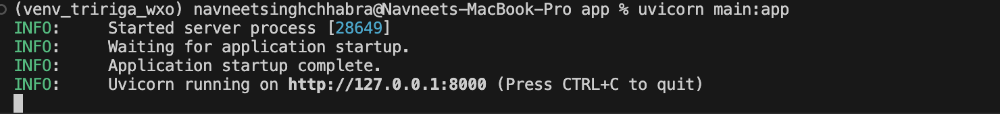


7. #### Now your application is running at localhost with port 8000. Go to the URL: http://localhost:8000/docs to test whether project is running correctly on local environment or not.


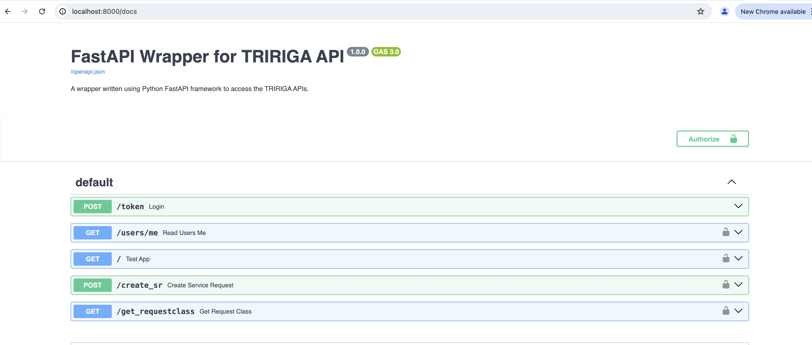


## Code Engine Deployment

#### IBM Cloud® Code Engine is a fully managed, serverless platform. Bring your container images, batch jobs, source code or function together in one place and let IBM Cloud Code Engine manage and help secure the underlying infrastructure. There's no need to size, deploy or scale container clusters yourself. And no advanced networking skills are required. Now, let's focus on deployment which have been explain in steps:


## Build
#### Once you push your code to the git remote repo, then you need to trigger the build on code engine so that your image could be built and stored in the container registry. 
#### Go to code engine service in the IBM cloud and click on projects:


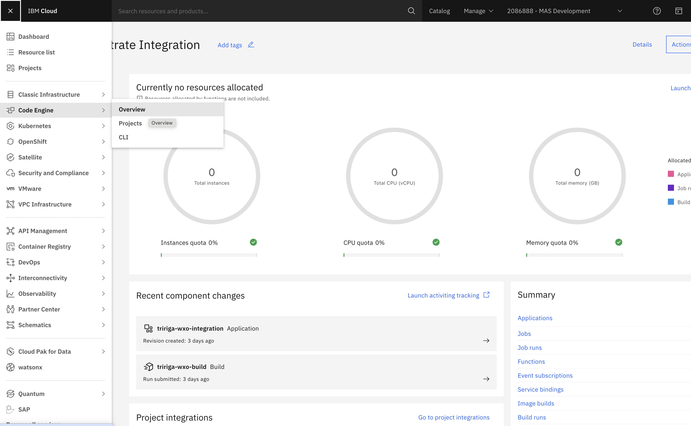


#### After you click on projects, you need to select the project named as "TRIRIGA-Orchestrate Integration":


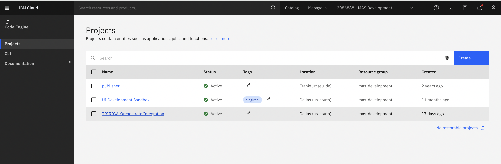


#### Now after coming to the project, click on "Image Builds" option on the left pane and you would able to see the builds done till now:


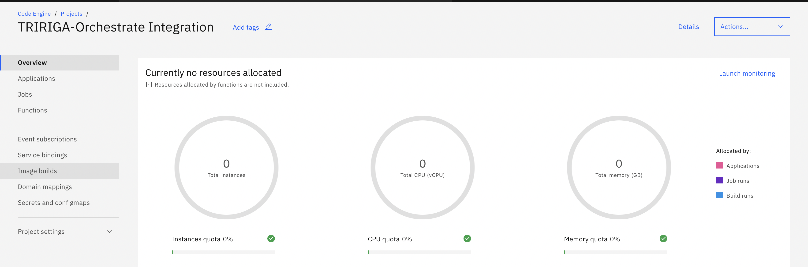


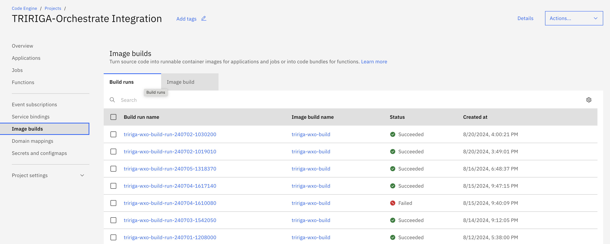


####  Go to "Image Build" tab that you can see above builds:
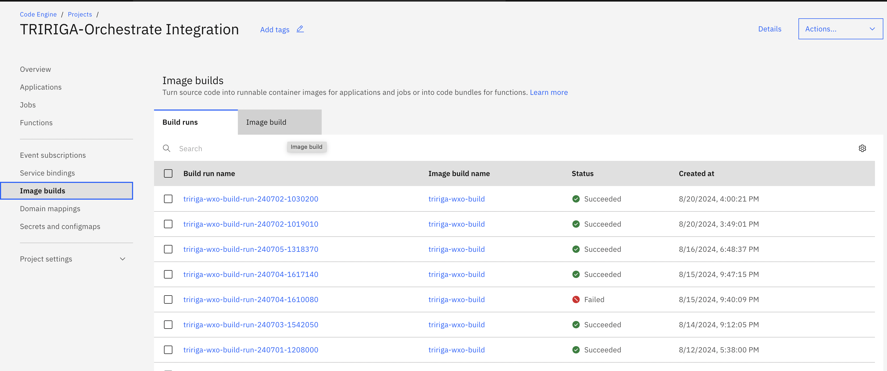

#### Click on "tririga-wxo-build" option:
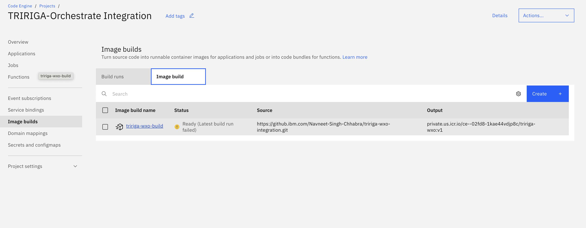

#### Now click on "Create" under the build runs which would be used to submit the build:
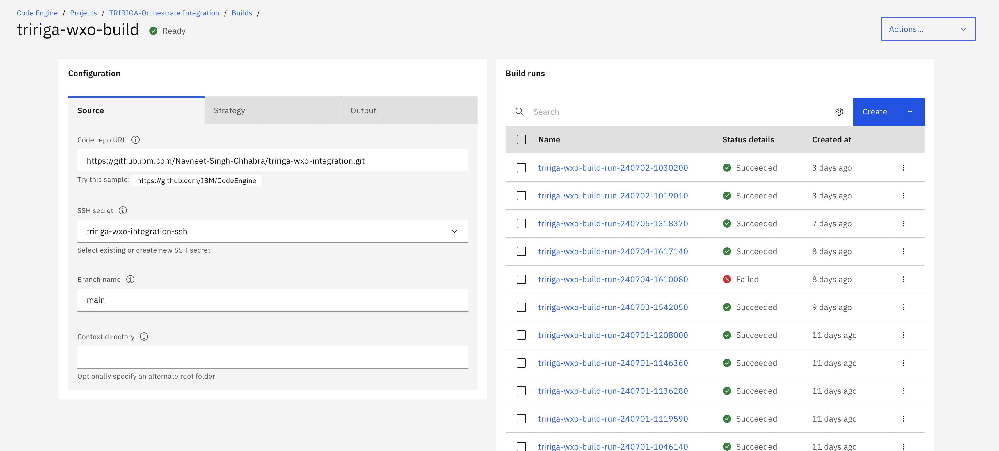

#### After that click on "Submit build":
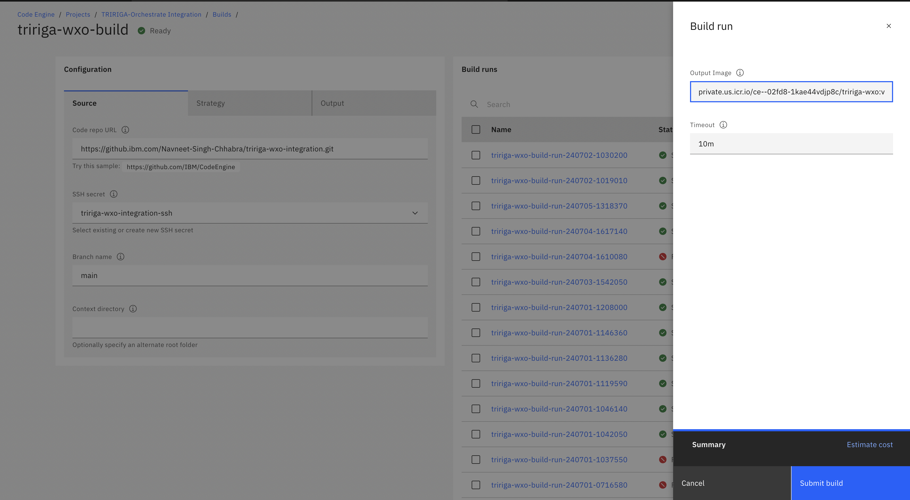

#### So, now your build is created


## Deploy

#### Once build is done, then next step is to deploy our application. For that please follow the below steps:

#### Go to "Applications" option on the left pane under the "TRIRIGA-Orchestrate Integration" project:
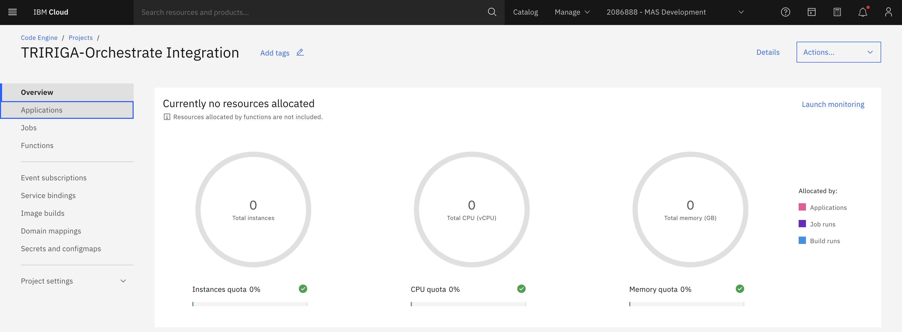

#### After clicking on "Applications", you would be navigated to list of apps that are under the "TRIRIGA-Orchestrate Integration" project. Now, click on "tririga-wxo-integration" application:
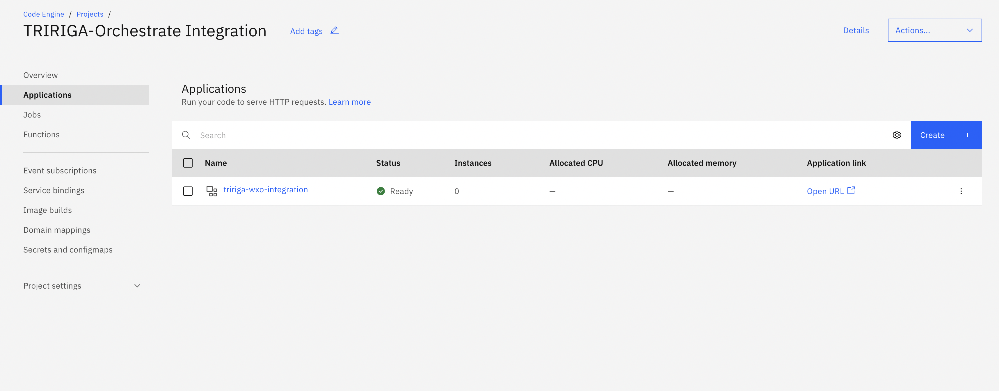

#### Now, go to "Configuration" tab under the application:
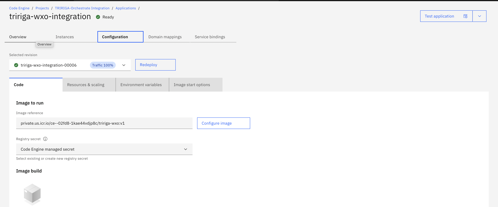

#### Click on "Re-deploy" button, to deploy the application:
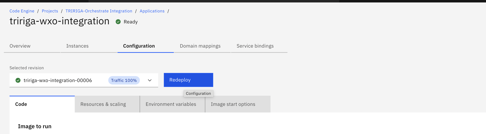

#### Now, our application is deployed


## Enabling the Watsonx Assistant into the TRIRIGA UI
1. In Watsonx Orchestrate find your `integrationId`, `regionId`, and `serviceId`. 
 - Note: to find the Watsonx Orchestrate `integrationId`, `regionId`, and `serviceId`. Navigate to `AI Assistant Builder` > `Environments` > `Web Chat` > `Embed`. 
2. In the TRIRIGA server, configure the TRIRIGAWEB.properties by adding `WATSON_ORCHESTRATE_ENABLED=TRUE`, `WATSON_ORCHESTRATE_INTEGRATION_ID=integrationId`, `WATSON_ORCHESTRATE_REGION_ID=regionId`, and `WATSON_ORCHESTRATE_INSTANCE_ID=serviceId`.

## Associating Basic Auth credentidals with Function/Application from CLI

1. Login to the IBM cloud CLI through terminal
2. After login, select the resource group
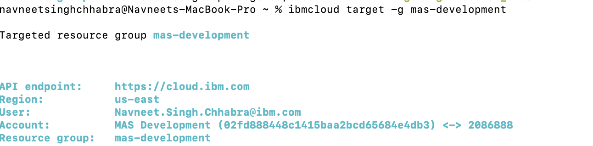
 - Here the resource group is mas-development

3. Now, we need to select the project in code engine by specifying the project ID
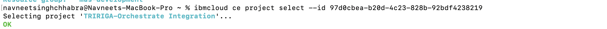

4. If you want to see the details of the "Function" created in the project engine, you can write down the command as:
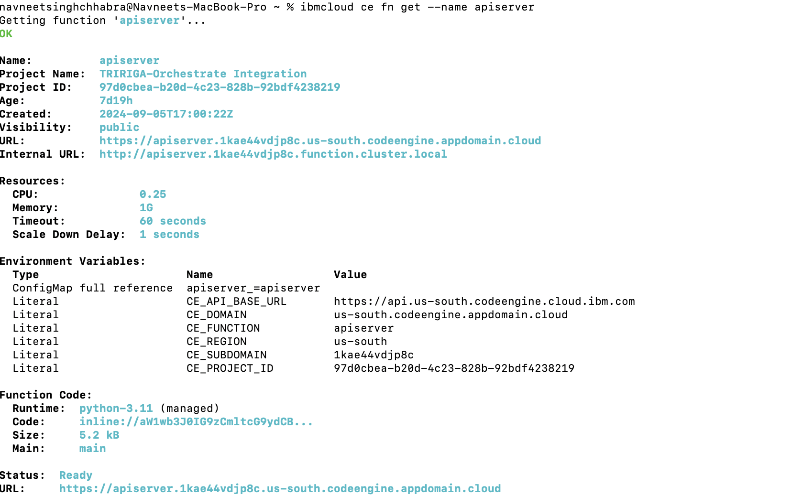

5. Now, to assocaiate basic auth secrets with the "Function", we specify:
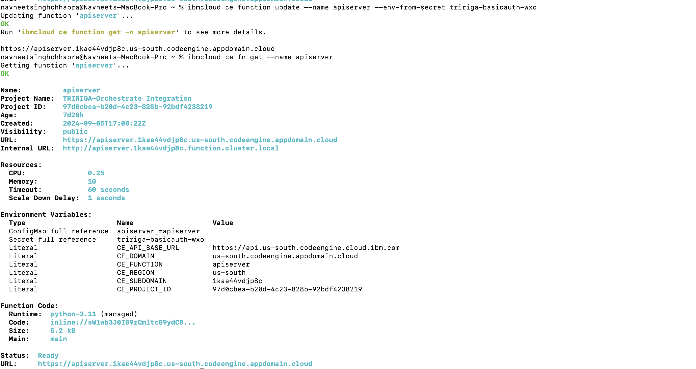


